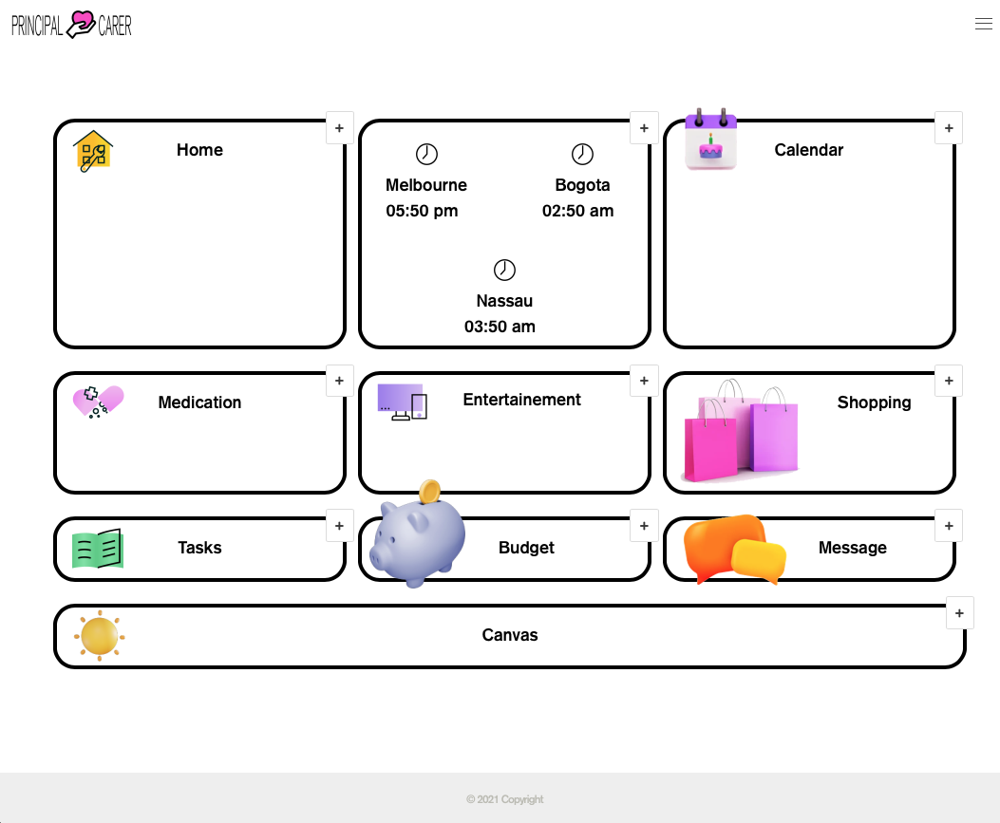

# Principal Carer

## Description

An application to help the user care and interact with their loved ones, with features to help the long distance carer.

Deployed app :link: https://vast-caverns-75554.herokuapp.com/

Github repository :link: https://github.com/avpizarro/principalcarer.git

## Table of Contents

- [Installation](#installation)
- [Usage](#usage)
- [Attributions](#attributions)
- [License](#license)
- [Questions](#questions)

## Installation

Visit this link to start using the app :link: https://vast-caverns-75554.herokuapp.com/

## Usage

The app has ten sections to make it easy to keep track of your loved one requirements.

A home section with the latest news and daily appointments.

Practical tools like a calendar, world clock, shopping, tasks and medication lists, budget tracker. 

There also sections to for fun, like an interactive drawing canvas, a chat room and the entertaiment module, where photos and videos can be added by family and friends.

## Attributions

 icon by Bharat from the Noun Project

## License

This Source Code Form is subject to the terms of the MIT License.
If a copy of the License was not distributed with this file, You can obtain one at https://opensource.org/licenses

## Questions

For further information please visit my GitHub page:
https://github.com/avpizarro

Or email me directly :e-mail: avpizarro@live.com
